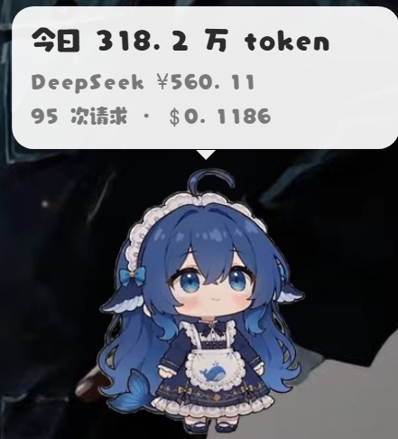

# dsh-pet-ccswitch 🐾

<p align="center">
  
</p>

把 [dsh-pet](https://github.com/PC2005-cloud/dsh-pet) 桌宠从 DeepSeek Harness 里**独立出来**，让它跟着 **[CC Switch](https://github.com/farion1231/cc-switch)** 过日子：

- **随 CC Switch 起落** —— CC Switch 一启动，桌宠自己出现；CC Switch 一退出，桌宠跟着消失
- **头顶气泡显示今日 token 用量 + 当前服务商余额**，数字全部取自 CC Switch 自己的数据库
- **右键菜单**：打开 CC Switch / 查看用量与余额 / 碎碎念 / 对话 / 点播任意动画
- 档位动画按**账户余额**分档（默认 ¥0~1000 分 6 档：钱袋满溢 → 分文不剩）

> 数据**一切以 CC Switch 为准**：不在本地另建一套账，而是直接读它的 `cc-switch.db`，
> 并执行你在它界面上为每个服务商配好的 `usage_script`。你在 CC Switch 里换服务商、改配置，
> 桌宠这边自动跟着变。

---

## 安装

```sh
npx github:cloud666666666/dsh-pet-ccswitch install
```

> 包**尚未发布到 npm registry**，所以 `npx dsh-pet-ccswitch` 暂时不通；用上面的 `github:` 写法
> 效果完全一样（npm 会直接从仓库拉取）。**下文所有 `npx dsh-pet-ccswitch <命令>` 在发布前
> 都请写成 `npx github:cloud666666666/dsh-pet-ccswitch <命令>`。**

`install` 会依次做完这些事（都会跳过已完成的部分，可重复跑）：

1. 准备 `dsh-pet` 插件（首次从 npm 拉，约 65MB）
2. 给它的产物打补丁（把气泡改成用量视图、菜单指向 CC Switch）
3. 准备 Electron（首次约 100MB；已有则跳过）
4. 把代码同步到 `%LOCALAPPDATA%\dsh-pet\app`（这样 `npx` 的临时目录删掉也不影响）
5. 注册开机自启，并立刻启动

**要求**：Windows + Node.js ≥ 22.5 + 已经装好并运行过 CC Switch。

## 命令

| 命令 | 作用 |
| --- | --- |
| `npx dsh-pet-ccswitch install` | 准备环境 + 注册自启 + 启动 |
| `npx dsh-pet-ccswitch start` / `stop` / `restart` | 启停宿主（宿主会带着桌宠一起） |
| `npx dsh-pet-ccswitch status` | 看宿主/CC Switch 状态、今日用量与余额 |
| `npx dsh-pet-ccswitch doctor` | 自检：CC Switch 在哪、库能不能读、缺什么 |
| `npx dsh-pet-ccswitch patch` | 升级 dsh-pet 后重新打补丁 |
| `npx dsh-pet-ccswitch uninstall [--purge]` | 移除自启（`--purge` 连运行数据一起删，配置会先备份） |

## 为什么能扛住 CC Switch 升级

这是设计目标之一，具体做法：

- **不写死安装路径**。找 `cc-switch.exe` 的顺序是：正在运行的进程 → 上次发现的路径 → 注册表卸载项 → 常见路径 → 开始菜单快捷方式。它换目录、换盘符都能自己跟上。
- **只依赖两样东西**：进程名（判活在不在）和它的数据库。前者按 `cc-switch*` 前缀匹配，后者用标准的 SQLite 读，且查询前后都有容错 —— 读不动会在 `doctor` 里明确告诉你，而不是崩掉。
- **余额查询不自己发明规则**：直接执行 CC Switch 为每个服务商配的 `usage_script`（`{request, extractor}`），它怎么查我们就怎么查。它加服务商、改解析逻辑，这边自动生效。
- **桌宠那边也一样**：所有改动都是**幂等补丁**，认不出原文时会告警并退化成原版行为，不会把桌宠搞坏。跑 `patch` 可随时重打。

## 工作原理

```
CC Switch  ←── 读 cc-switch.db（用量/服务商/usage_script）──┐
     ▲                                                      │
     │ 进程在不在                                          ▼
     └──────────── 宿主 host.mjs ──── HTTP :3080 ──── 桌宠（Electron 透明小窗）
```

- CC Switch 是**数据源**，也是**生命周期信号源**（宿主每 2 秒看一次它的进程）
- 桌宠本体是原版 `dsh-pet`（只打了补丁），跑在自带的 Electron 上
- 宿主的 HTTP 接口是照着 dsh-pet 原本的契约实现的，所以桌宠换新版本也大概率能直接用

## 配置

运行数据在 `%LOCALAPPDATA%\dsh-pet\`：

| 文件 | 说明 |
| --- | --- |
| `user/main-config.json` | 桌宠配置：大小 / 位置 / 显示方式 / 碎碎念开关 |
| `user/memory.json` | 对话记忆（删掉即清空） |
| `runtime.json` | 记住发现到的 `cc-switch.exe` 路径等 |
| `logs/host.log` | 宿主日志 |

环境变量：

| 变量 | 默认 | 说明 |
| --- | --- | --- |
| `DSH_PET_HOME` | `%LOCALAPPDATA%\dsh-pet` | 运行数据目录 |
| `PET_HOST_PORT` | `3080` | 宿主端口 |
| `PET_TIER_MAX` | `1000` | 档位刻度：余额到这个数 = 第 0 档「钱袋满溢」 |
| `PET_FOLLOW` | `1` | 设为 `0` 关闭「跟随 CC Switch」 |
| `PET_FOLLOW_INTERVAL` | `2000` | 跟随检查间隔（ms） |
| `PET_LLM_PROXY` | `http://127.0.0.1:15721` | 碎碎念/对话用的通道（CC Switch 的本地代理） |
| `PET_LLM_MODEL` | `claude-haiku-4-5` | 同上 |
| `CCS_DB` | `~/.cc-switch/cc-switch.db` | CC Switch 数据库路径 |
| `PET_CC_PROCESS` | 自动 | 覆盖「CC Switch 进程」的匹配条件（排障用） |

## 碎碎念 / 对话

走 CC Switch 的本地代理调模型，**只在你点右键菜单时才会调用**，单次约 100~200 token。
不点就不会有额外消耗。

## 已知限制

- **仅 Windows**（进程发现、自启、窗口置前都用了 Windows 专有手段）
- 界面上显示的是「CC Switch 当前在用」那一个服务商的余额（取最近一条请求实际走到的服务商）。
  计价单位默认按人民币余额校准（`PET_TIER_MAX`），换成美元计价的服务商时这个刻度含义会变
- 余额查不到时不会伪造数字，会显示失败原因 —— 这是原版就有的设计

## 致谢

桌宠本体是 [dsh-pet](https://github.com/PC2005-cloud/dsh-pet)（MIT），本包只做适配与宿主。
